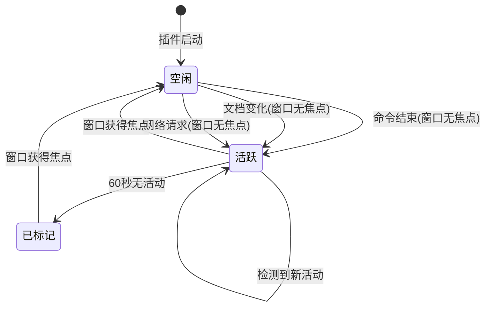

# Augment 完成监控 - 状态流程文档

## 📊 核心状态

```
空闲 (Idle) ←→ 活跃 (Active) → 已标记 (Marked)
```

## 🔄 状态转换图



## 📝 状态详解

### 状态 1：空闲 (Idle)

**特征**：
- `isActive = false`
- `lastActivityTime = null`
- `activityCount = 0`

**触发条件**：
- 插件启动
- 窗口获得焦点（从任何状态重置）

### 状态 2：活跃 (Active)

**特征**：
- `isActive = true`
- `wasActive = true`
- `lastActivityTime = 当前时间`
- `activityCount > 0`

**进入条件**（必须同时满足）：
1. 窗口无焦点
2. 不在预热期（启动后10秒内）
3. 检测到以下活动之一：
   - 终端命令结束
   - 文档内容变化
   - 网络请求（Augment API）

**保持条件**：
- 持续检测到新活动
- 每次新活动更新 `lastActivityTime`

### 状态 3：已标记 (Marked)

**特征**：
- 窗口标题显示 `🔔 项目名称`
- 输出面板显示完成消息

**进入条件**：
- 从活跃状态
- 60秒内无新活动
- 窗口仍然无焦点

## 🔍 活动检测流程

### A. 命令结束检测

```
终端命令结束事件
    ↓
检查：在预热期内？
    ├─ 是 → 忽略（记录日志）
    └─ 否 ↓
检查：窗口有焦点？
    ├─ 是 → 忽略（用户能看到）
    └─ 否 ↓
记录活动 #N
    ↓
进入/保持活跃状态
    ↓
更新 lastActivityTime
    ↓
开始/重置 60秒倒计时
```

### B. 文档变化检测

```
文档内容变化事件
    ↓
检查：在预热期内？
    ├─ 是 → 忽略
    └─ 否 ↓
检查：窗口有焦点？
    ├─ 是 → 忽略
    └─ 否 ↓
检查：文件在白名单？
    ├─ 否 → 忽略
    └─ 是 ↓
记录活动 #N
    ↓
进入/保持活跃状态
    ↓
更新 lastActivityTime
    ↓
开始/重置 60秒倒计时
```

### C. 网络请求检测

```
HTTP/HTTPS 请求
    ↓
检查：在预热期内？
    ├─ 是 → 忽略
    └─ 否 ↓
检查：窗口有焦点？
    ├─ 是 → 忽略
    └─ 否 ↓
检查：是 Augment API？
    ├─ 否 → 忽略
    └─ 是 ↓
记录活动 #N
    ↓
进入/保持活跃状态
    ↓
更新 lastActivityTime
    ↓
开始/重置 60秒倒计时
```

## ⏱️ 空闲倒计时流程

```
活跃状态 + lastActivityTime 已设置
    ↓
每秒检查一次（checkIdleState）
    ↓
计算：当前时间 - lastActivityTime
    ↓
检查：是否 >= 60秒？
    ├─ 否 → 继续等待
    └─ 是 ↓
检查：isActive && wasActive？
    ├─ 否 → 不触发标记
    └─ 是 ↓
触发完成标记
    ↓
调用 titleManager.markCompletion()
    ↓
窗口标题显示 🔔
    ↓
输出面板显示完成消息
```

## 🪟 窗口焦点变化流程

```
窗口焦点状态变化
    ↓
检查：从无焦点 → 有焦点？
    ├─ 否 → 只记录日志
    └─ 是 ↓
重置所有状态：
    - lastActivityTime = null
    - isActive = false
    - wasActive = false
    - activityCount = 0
    ↓
检查：窗口已标记？
    ├─ 否 → 完成
    └─ 是 ↓
清除标记：
    - 移除标题栏的 🔔
    - 记录日志
```

## 📅 完整时间线示例

```
时间    | 事件                          | 状态      | 窗口焦点 | 计数 | 倒计时
--------|-------------------------------|-----------|----------|------|--------
00:00   | 插件启动                      | 空闲      | 有       | 0    | -
00:10   | 预热期结束                    | 空闲      | 有       | 0    | -
00:15   | 用户切换到浏览器              | 空闲      | 无       | 0    | -
00:20   | Augment 执行命令              | 空闲      | 无       | 0    | -
00:25   | 命令结束(无焦点)              | 活跃      | 无       | 1    | 0秒
00:30   | Augment 修改文件              | 活跃      | 无       | 2    | 0秒(重置)
00:45   | Augment 发送网络请求          | 活跃      | 无       | 3    | 0秒(重置)
01:00   | 无新活动                      | 活跃      | 无       | 3    | 15秒
01:30   | 无新活动                      | 活跃      | 无       | 3    | 45秒
01:45   | 60秒倒计时完成                | 已标记    | 无       | 3    | 60秒
        | 窗口标题显示 🔔               |           |          |      |
02:00   | 用户切换回 VSCode             | 空闲      | 有       | 0    | -
        | 清除标记                      |           |          |      |
```

## ⚙️ 配置参数影响

| 参数 | 默认值 | 影响的流程 |
|------|--------|-----------|
| `idleThreshold` | 60秒 | 活跃 → 已标记 的等待时间 |
| `warmupPeriod` | 10秒 | 启动后忽略活动的时间 |
| `completionMarker` | `🔔 ` | 标记的显示符号 |
| `enabled` | `true` | 是否启用整个监控 |
| `verbose` | `false` | 是否显示详细日志 |

## 🔒 关键过滤条件

所有活动检测都必须通过以下过滤：

1. **预热期过滤**：启动后 10 秒内忽略所有活动
2. **窗口焦点过滤**：窗口有焦点时忽略所有活动
3. **白名单过滤**（文档变化）：只监控特定 scheme 的文件
4. **API 过滤**（网络请求）：只监控 Augment API 请求

## 🔄 状态重置触发

以下情况会完全重置状态：

1. **窗口获得焦点**
2. **手动执行命令**：
   - `Augment: 清除完成标记`
   - `Augment: 禁用完成监控`

## 💡 核心设计思想

- **只在窗口无焦点时记录活动**（用户看不到）
- **60秒无活动后显示标记**（任务完成）
- **窗口获得焦点时重置**（用户回来了）


